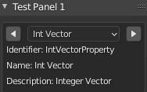

# Prev_Next_operators_enumlist
Blender 2.9x Example panel and operators for incrementing and decrementing through options of pre-defined enumerated list. Based on question https://blenderartists.org/t/increment-value-of-an-enumproperty/1288343/3.

* Operators to increment or decrement through enumerated list and reset index if required to cycle through end points.